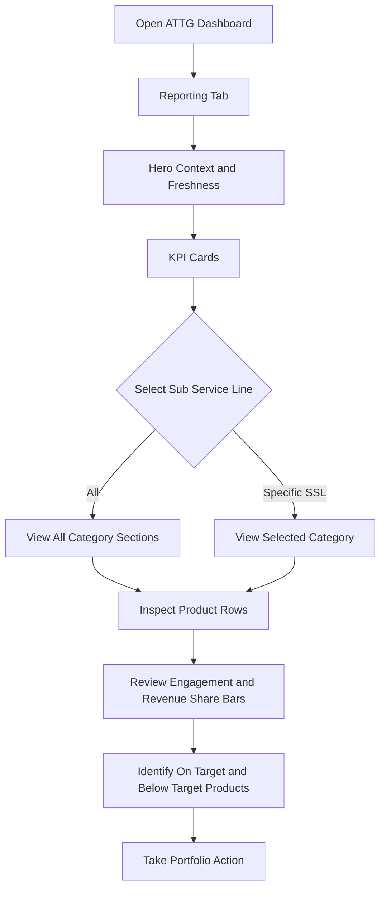
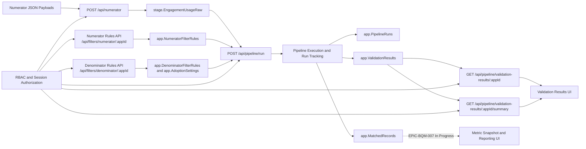

# Project Goals and Definition

**Product:** ATTG Application Usage Dashboard

## [1] Problem Statement

Reporting and portfolio analysis are currently produced manually with spreadsheets, which creates risk in consistency, auditability, and access control. Leadership needs a governed dashboard backed by a traceable pipeline so adoption and revenue metrics are reproducible, role-secure, and decision-ready.

## [2] Business Context

1. Adoption pipeline requirements are already documented in stakeholder and architecture artifacts.
2. The largest remaining data gap is investment source definition and onboarding.
3. This document defines goals, scope boundaries, and epic alignment for current and next planning cycles.

## [3] Product Vision

1. Replace spreadsheet-driven reporting with governed analytics.
2. Show where product investment translates into adoption and revenue outcomes.
3. Detect below-target performance early.
4. Preserve auditability, consistency, and role-based access.

## [4] Solution Purpose

1. The solution combines:
   - Next.js + TypeScript web application for dashboard and administration.
   - Azure SQL data model for staging, governance, and reporting persistence.
   - Azure Data Factory orchestration for denominator refresh and processing.
2. Core flow:
   - Ingest numerator payloads.
   - Validate and process against denominator data.
   - Calculate adoption and revenue metrics.
   - Persist historical snapshots with run traceability.
   - Serve metrics to the dashboard according to RBAC scope.

## [5] Current Epic Alignment

### [5.1] Implemented or Delivered in Current Codebase

1. EPIC-BQM-001: Database Foundation
2. EPIC-BQM-010: Baseline CI Pipeline
3. EPIC-BQM-002: User Administration
4. EPIC-BQM-003: Numerator Ingestion API
5. EPIC-BQM-004: Numerator Filter Configuration
6. EPIC-BQM-005: Authentication and Authorization
7. EPIC-BQM-006: Validation and Processing Pipeline
8. EPIC-BQM-008: Denominator Rules Configuration

### [5.2] Defined and In Progress (Not Yet Implemented End-to-End)

1. EPIC-BQM-007: Metrics Calculation and Dashboard Display

### [5.3] Planned for Redefinition and Future Additions

1. EPIC-BQM-009: External API Integration
2. EPIC-BQM-011: Azure Infrastructure IaC
3. EPIC-BQM-012: CD Pipeline
4. EPIC-BQM-016: AI-Assisted Rules Configuration and Dashboard Insights
5. Additional epics to be added after investment-data and reporting-roadmap decisions are finalized.

## [6] Scope Model

### [6.1] Current Delivery Scope

1. Governed ingestion and validation pipeline for adoption data.
2. Role-based user and application-access management.
3. Configurable numerator and denominator filter rules.
4. Pipeline run traceability and validation evidence.

### [6.2] Next Delivery Scope

1. Metrics snapshot calculation completion and dashboard presentation hardening.
2. Investment data source onboarding and reconciliation controls.
3. Extended reporting slices after baseline metric stability.
4. Optional AI assistant support for denominator-rule drafting, adoption-setting configuration guidance, and dashboard narrative analysis.

## [7] Business Goals

1. Establish one governed reporting source instead of manual files.
2. Maintain canonical KPI definitions with clear ownership and lineage.
3. Preserve intuitive hierarchy for analysis: portfolio -> sub service line -> product.
4. Ensure secure, auditable ETL and serving paths for production reporting.
5. Introduce investment metrics only after source-system governance is approved.

## [8] Canonical KPI Contract (Current and Planned)

### [8.1] Current KPI Foundation

1. Adoption percentage from matched numerator over filtered denominator.
2. Revenue percentage using application-configured revenue basis.
3. On-target status driven by approved threshold policy.

### [8.2] Planned KPI Expansion (Post Investment Onboarding)

1. Total investment.
2. ROI proxy and investment variance views.
3. Weighted portfolio performance scoring, pending policy approval.

## [9] Information Organization and Grouping

1. Portfolio level:
   - Global KPI cards for selected scope.
2. Sub Service Line level:
   - Section-level rollups with quick health context.
3. Product level:
   - Detailed metrics per application.
4. Time grouping:
   - Revenue basis: ETD and FYTD.
   - Reporting periods: daily aggregation with fiscal rollups.
5. Filter grouping:
   - All Sub Service Lines.
   - Single Sub Service Line.

## [10] Presentation and UX Model

1. Hero area:
   - Dashboard title and business narrative.
   - Data freshness timestamp and last successful pipeline run id.
2. KPI cards:
   - Investment, Revenue, Avg. Engagement, On Target Rate.
   - Optional badges: data quality score, completeness.
3. Filter bar:
   - Sub Service Line selector as pill tabs.
   - Period selector as planned enhancement.
4. Category detail panel:
   - Section rollups and product rows.
   - Product bars for Engagement and Revenue Share.
   - Status chip: On target or Below target.
5. Footer legend:
   - ETD/FYTD definitions and metric-version reference.

## [11] KPI Rules, Semantics, and Thresholds

1. Default on-target threshold is 70% engagement.
2. Status semantics:
   - On target: product meets threshold policy.
   - Below target: product fails threshold policy.
3. Threshold governance:
   - Configurable by metric definition version.
   - Effective dates required for auditability.
4. Calculation controls:
   - Denominator protection for division by zero.
   - Null handling and fallback rules documented per KPI.
5. Metadata required for every KPI payload:
   - Definition version.
   - Refresh timestamp.
   - Source batch id.
   - Data-quality flags.

## [12] Data Pipeline Requirements (ETL)

1. Ingestion:
   - Load raw adoption and usage payloads into staging.
   - Load investment records from approved system of record.
2. Validation:
   - Schema checks, business-rule checks, duplicate detection.
   - Route invalid records to reject or quarantine tables with reason codes.
3. Transformation:
   - Normalize to canonical dimensions and facts.
   - Derive ETD/FYTD periods and category mappings.
4. Aggregation:
   - Build daily and fiscal-period reporting aggregates.
5. Publish:
   - Expose governed reporting views and API models.
6. Controls:
   - End-to-end audit fields, job-run lineage, reconciliation checks.

## [13] Data Requirements

1. Adoption and usage data:
   - Event timestamp, application id, engagement id, client id, actor id, usage flags.
2. Organizational data:
   - Service Line, Sub Service Line, application metadata.
3. Financial data:
   - Investment amount, currency, fiscal period, source system, version date.
   - Revenue amount and period basis.
4. Governance data:
   - Source system id, batch id, validation status, processing status.

## [14] Investment Data Source Gap

1. Current status:
   - Adoption metrics pipeline specification exists.
   - Investment source system and ingestion contract are not finalized.
2. Required decisions:
   - Authoritative investment source and owner.
   - Refresh cadence.
   - Data grain and allocation model.
   - Currency handling and normalization rules.
   - Backfill and revision policy.
3. Exit criteria:
   - Approved source-to-target mapping document.
   - Automated ingestion job in ETL pipeline.
   - Reconciliation sign-off between source and reporting fact.

## [15] Data Model Requirements

1. Core dimensions:
   - Date
   - Application
   - Service Line
   - Sub Service Line
   - Client
   - Engagement
   - Actor/User
2. Core facts:
   - Usage event fact.
   - Application daily fact.
   - Financial fact.
3. Data quality and staging:
   - Immutable raw staging.
   - Reject or quarantine table with error taxonomy.
   - Processing state and retry fields.
4. Governance:
   - Audit fields on governed tables.
   - Parameterized SQL and controlled write paths.

## [16] Functional Requirements

1. Dashboard loads live metrics from governed reporting views.
2. User filters by Sub Service Line and period basis.
3. KPI cards and detail sections update to selected scope.
4. Category sections show rollups and product-level detail rows.
5. ETD/FYTD basis is visible for revenue-oriented metrics.
6. Empty state is displayed for no-data conditions.
7. Metric metadata is available to users.
8. Role-based access controls are enforced server-side.
9. Date-based filtering control is deferred in current UI release.
10. Optional AI assistant can suggest denominator filter rules for user review before save.
11. Optional AI assistant can suggest denominator adoption settings with rationale and confidence.
12. Optional AI assistant can provide dashboard analysis summaries from governed metric outputs.

## [17] Non-Functional Requirements

1. Performance:
   - Initial load under 2.5 seconds for standard portfolio scope.
   - Filter response under 500 ms with pre-aggregated views.
2. Reliability:
   - Daily ETL success target >= 99%.
   - Automatic alerting for failed pipeline runs.
3. Security:
   - RBAC and secure secret handling.
   - Controlled sharing path and minimized accidental disclosure.
4. Accessibility:
   - Keyboard-navigable filters.
   - Semantic labels for charts and progress bars.
   - Reduced-motion support.
5. Observability:
   - Pipeline runtime metrics, query latency, and data-freshness SLA monitoring.

## [18] Dependencies

1. Existing adoption pipeline behavior and quality gates.
2. Role and identity configuration for production authorization.
3. SQL reporting schema evolution for snapshot and aggregate needs.
4. Investment source onboarding and contract approval.
5. Business sign-off on KPI formulas and threshold policy.

## [19] Rollout Plan

1. Phase 1: Foundation
   - Implement canonical KPI layer and data freshness metadata.
   - Keep current UI scope without Date selector.
   - Go-live with adoption and revenue where available.
2. Phase 2: Investment Integration
   - Add finalized investment source ingestion.
   - Enable ROI proxy and investment variance reporting.
3. Phase 3: Advanced Insights
   - Add Date and period controls, trends, drill-down, and benchmark alerts.
4. Phase 4: AI-Guided Configuration and Analysis
   - Add optional AI assistant for denominator rule and adoption-setting recommendations.
   - Add optional dashboard insight summaries with explicit non-authoritative labeling.

## [20] Risks and Mitigations

1. Metric ambiguity across teams.
   - Mitigation: metric definition registry and sign-off workflow.
2. Investment source delays.
   - Mitigation: phased rollout with placeholder logic and tracked dependency.
3. Data quality issues in upstream payloads.
   - Mitigation: validation gates, reject handling, reconciliation reports.
4. Unauthorized report exposure.
   - Mitigation: strict RBAC, audited access, centralized delivery channel.

## [21] Open Questions

1. Final definition of On Target: engagement-only or composite score?
2. Weighting policy for On Target Rate.
3. Authoritative investment source and ownership model.
4. Required reporting cadence for leadership reviews.
5. Required drill-down dimensions for v1.
6. Required approval workflow for AI-proposed denominator rules and adoption settings.
7. Required confidence threshold to show AI recommendations to end users.

## [22] Non-Goals

1. Predictive forecasting in current release window.
2. Full self-service metric builder in v1.
3. External client-facing publishing workflows.
4. Custom BI authoring experience inside the product.

## [23] Acceptance Criteria for This Goal Baseline

1. Duplicated goal and scope statements are consolidated into one canonical structure.
2. Goals are explicitly aligned to existing epic inventory.
3. Implemented versus not-yet-implemented epics are clearly separated.
4. Future and redefinition epic space is explicit without blocking delivered scope.

## [24] Local Development Checklist

1. Environment readiness:
   - Backend runs without errors and listens on configured port.
   - Frontend runs without errors and loads in browser.
2. Integration readiness:
   - Frontend configuration points to correct backend URL.
   - Backend CORS allows frontend origin.
3. Browser readiness:
   - Browser DevTools console shows no connection errors on load.

## [A] Appendix - Metrics Definitions (Canonical Formulas)

---

### [A.1] Engagement Metric (Adoption Percentage)

$$
engagement = \max(0, \min(100, adoptionPercent))
$$

$$
adoptionPercent = \frac{NumeratorCount}{DenominatorCount} \times 100
$$

Where:
- `NumeratorCount` = count of DISTINCT numerator keys (ClientID or EngagementID per AdoptionLevel) that pass validation and denominator matching
- `DenominatorCount` = count of DISTINCT denominator keys (ClientID or EngagementID per AdoptionLevel)

**Clipping**: Ensures value is bounded to [0, 100] range.

**Semantics**: Represents the percentage of addressable population that matched and was validated.

### [A.2] Revenue Share Metric (Revenue Percentage)

$$
revenueShare = \max(0, \min(100, revenuePct))
$$

$$
revenuePct = \frac{NumeratorRevenue}{DenominatorRevenue} \times 100
$$

Where:
- `NumeratorRevenue` = sum of deduplicated numerator-key revenue from model metric field (`IsMetricDimension` source path)
- `DenominatorRevenue` = sum of filtered denominator revenue using `AdoptionSettings.RevenueMetric`

**Clipping**: Ensures value is bounded to [0, 100] range.

**Revenue Basis Selection**: `revenueBasis = \text{FYTD} \mid \text{ETD}` is controlled per application in `AdoptionSettings.RevenueMetric`.

**Semantics**: Represents the percentage of addressable revenue captured by matched records.

### [A.3] On Target (High Adoption Indicator)

$$
onTarget = \text{isHighAdoption} \quad (\text{engagement} > 70\%)
$$

`onTarget` is a UI helper boolean derived from adoption percentage and is not persisted in database snapshots.

**Threshold Policy**: Default engagement threshold is 70%, overridable via approved governance policy.

**Semantics**: Binary indicator showing whether adoption has reached high-adoption threshold.

Validation rule:
- Validation must detect DISTINCT numerator keys that are not present in filtered denominator scope (based on adoption level key type) and mark them invalid.

### [A.4] Average Engagement

$$
AvgEngagement = \frac{\sum EngagementScores}{COUNT(\text{DISTINCT EngagementId})}
$$

**Current State**: NULL (awaiting per-matched-record engagement score data).

**Future Implementation**: Will aggregate engagement scores from matched records once engagement metric is available per record.

**Semantics**: Average engagement level across matched records.

### [A.5] Total Investment

$$
TotalInvestment = \sum InvestmentAmount
$$

### [A.6] Total Revenue

$$
TotalRevenue = \sum RevenueAmount
$$

### [A.7] Filter Rate

$$
FilterRate\% = \frac{FilteredUsage}{AvailableUsage} \times 100
$$

### [A.8] Revenue Share by Product

$$
RevenueShareProduct\% = \frac{ProductRevenue}{ServiceLineRevenue} \times 100
$$

### [A.9] ROI Proxy

$$
ROI\% = \frac{Revenue - Investment}{Investment} \times 100
$$

---

## [B] Appendix - Frames

### [B.1] Frame Overview

1. Context section:
   - What the dashboard is about.
2. Summary section:
   - Portfolio-level performance.
3. Scope selection section:
   - Which Sub Service Line is analyzed.
4. Detail breakdown section:
   - Which products drive results.
5. Reference section:
   - Metric definitions and period references.

---

### [B.2] Screen Layout Blueprint

```text
+-----------------------------------------------------------------------------------+
| Header / Navigation                                                               |
+-----------------------------------------------------------------------------------+
| Reporting Hero                                                                    |
| - Title: ATTG Product Adoption Metrics Summary                                    |
| - Subtitle: business outcome statement                                            |
| - Freshness / draft / status chip                                                 |
+-----------------------------------------------------------------------------------+
| KPI Cards (Row)                                                                   |
| [Investment] [Revenue] [Avg. Engagement] [On Target Rate]                         |
+-----------------------------------------------------------------------------------+
| Filter Bar                                                                        |
| Sub Service Line: [All] [BTS] [INDIRECT TAX] [LAW] [ITTS] ...                    |
+-----------------------------------------------------------------------------------+
| Detail Sections (repeat per selected category)                                    |
| Category: <Sub Service Line>                                                      |
|   Rollups: Investment | Revenue | Avg. Engagement                                 |
|   Product Rows:                                                                   |
|     - Product name + Status chip                                                  |
|     - Investment, Revenue (ETD/FYTD)                                              |
|     - Engagement bar (%)                                                          |
|     - Revenue share bar (%)                                                       |
|     - Notes (optional)                                                            |
+-----------------------------------------------------------------------------------+
| Footer Legend                                                                     |
| ETD definition | FYTD definition | KPI version / reference                        |
+-----------------------------------------------------------------------------------+
```

## [C] Appendix - Diagrams

### [C.1] User Navigation Flow



---

### [C.2] ETL to Reporting UI Data Flow

1. Implemented epic coverage in this flow:
   - EPIC-BQM-001 (database schema and staging/reporting tables)
   - EPIC-BQM-003 (numerator ingestion API)
   - EPIC-BQM-004 (numerator filter configuration)
   - EPIC-BQM-005 (RBAC and authorization enforcement)
   - EPIC-BQM-006 (pipeline run orchestration and validation persistence)
   - EPIC-BQM-008 (denominator rules and adoption settings)
2. In-progress handoff explicitly marked:
   - EPIC-BQM-007 (metric snapshot and reporting dashboard path)


